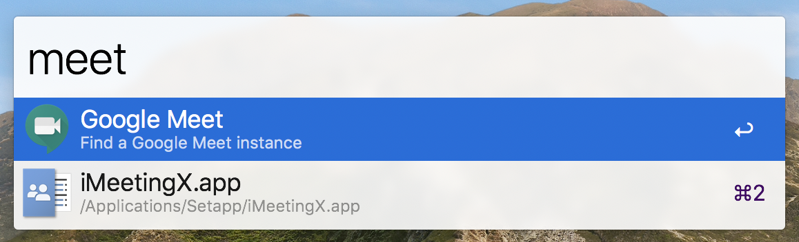

# Chrome Google Meet Alfred Workflow

Open (or find an existing) Google Meet tab in Google Chrome.

## Usage

By default:

- Use the `meet` keyword to find the first Google Meet tab, or open a new one.
- Use the `meet` keyword with the `⌘` modifier to open a new Google Meet tab.

The workflow also includes hotkeys for both actions, but they are not set by default.

## Credits

Adapted from the workflow from [this blog post] ([archive link])

[this blog post]: https://dance.computer.dance/posts/2019/07/finding-open-web-pages-with-alfred.html
[archive link]: https://web.archive.org/web/20200617014510/https://dance.computer.dance/posts/2019/07/finding-open-web-pages-with-alfred.html
